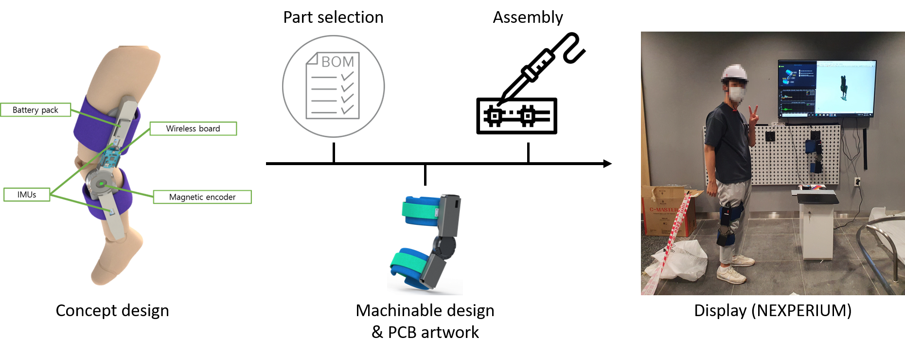

<head>

</head>

## My Skills

---

### <mark>Machine learning</mark>
- Implement of developed models
- Solve real-world problems using ML
- Learning-based pysics simulation in Isaac Gym

(You can see [#Projects tab](/projects) to see the projects using ML)

---

### <mark>PCB artwork</mark>
- From datasheets to a PCB

---
### <mark>Embedded programming</mark>
- Development of libraries for sensors
- Basic wireless communication

---
### <mark>Basic mechanical system design</mark>
- Mechanical design for machining or printing
- Part selecting, programming, wiring and etc.

<!--
<figure>
  
  <figcaption align = "center">Wearable experience module, funded by Shinsegae</figcaption>
  <figcaption>Wearable experience module, funded by Shinsegae</figcaption>
</figure>
-->

<!--
  
  
-->

---
### <mark>Rendering and image processing</mark>
- Image source generating and post-processing
- Basic skills on Photoshop and Illustrator

---

<!-- 
Page template forked from <a href="https://github.com/evanca/quick-portfolio">evanca</a>
 -->
<!-- Remove above link if you don't want to attibute -->
